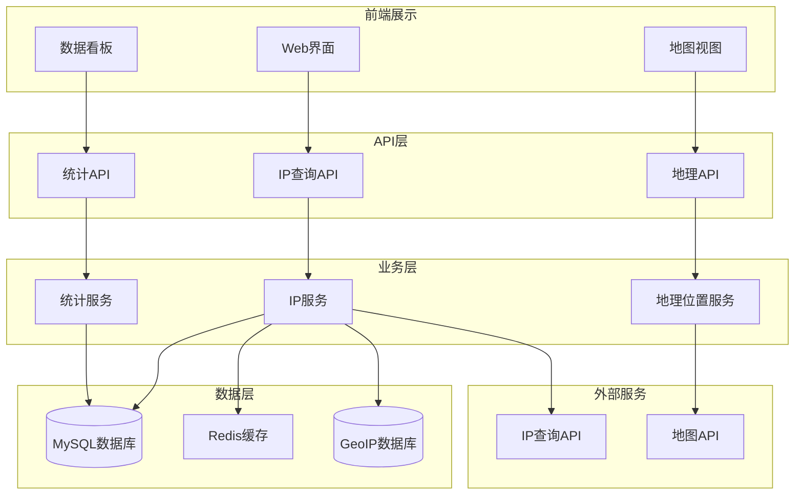

# 🌍 JOSP-IPDisplay - IP地址展示系统


## 📖 项目简介

JOSP-IPDisplay是一个IP地址信息展示系统,提供IP地址查询、地理位置定位、访问统计等功能,可用于网站访问分析、用户地域分布统计等场景。

## 🏗️ 系统架构



## 🚀 快速开始

### 环境要求

- JDK 17+
- Node.js 16+
- MySQL 8.0+
- Redis 6.0+

### 安装步骤

```bash
# 1. 克隆项目
git clone https://github.com/yourusername/JOSP-ipDisplay.git

# 2. 后端配置
cd JOSP-ipDisplay/backend
mvn clean install
mvn spring-boot:run

# 3. 前端配置
cd ../frontend
npm install
npm run dev
```

## 🛠️ 技术栈

| 技术 | 版本 | 说明 |
|------|------|------|
| Spring Boot | 3.x | 后端框架 |
| Vue.js | 3.x | 前端框架 |
| MaxMind GeoIP | - | IP地理位置库 |
| MySQL | 8.0+ | 数据库 |
| Redis | 6.0+ | 缓存 |

## 📁 项目结构

```
JOSP-ipDisplay/
├── backend/
│   ├── src/main/java/com/josp/ipdisplay/
│   │   ├── controller/
│   │   ├── service/
│   │   ├── mapper/
│   │   └── entity/
│   └── pom.xml
├── frontend/
│   ├── src/
│   │   ├── views/
│   │   ├── components/
│   │   └── api/
│   └── package.json
└── README.md
```

## 🔑 核心功能

### IP查询

```java
@RestController
@RequestMapping("/api/ip")
public class IPController {
    
    @Autowired
    private IPService ipService;
    
    @GetMapping("/query")
    public Result<IPInfo> queryIP(@RequestParam String ip) {
        return Result.success(ipService.queryIPInfo(ip));
    }
    
    @GetMapping("/my")
    public Result<IPInfo> getMyIP(HttpServletRequest request) {
        String ip = getClientIP(request);
        return Result.success(ipService.queryIPInfo(ip));
    }
}
```

### 地理位置查询

```java
@Service
public class GeoService {
    
    @Autowired
    private GeoIPDatabase geoDatabase;
    
    public GeoLocation getGeoLocation(String ip) {
        // 查询地理位置信息
        GeoLocation location = geoDatabase.lookup(ip);
        
        return GeoLocation.builder()
            .country(location.getCountry())
            .province(location.getProvince())
            .city(location.getCity())
            .latitude(location.getLatitude())
            .longitude(location.getLongitude())
            .build();
    }
}
```

### 访问统计

```java
@Service
public class StatsService {
    
    @Autowired
    private StatsMapper statsMapper;
    
    public void recordVisit(String ip, String page) {
        VisitRecord record = new VisitRecord();
        record.setIp(ip);
        record.setPage(page);
        record.setVisitTime(LocalDateTime.now());
        
        statsMapper.insert(record);
    }
    
    public VisitStats getStats(LocalDate startDate, LocalDate endDate) {
        return VisitStats.builder()
            .totalVisits(statsMapper.countVisits(startDate, endDate))
            .uniqueVisitors(statsMapper.countUniqueIPs(startDate, endDate))
            .topCountries(statsMapper.getTopCountries(startDate, endDate))
            .topCities(statsMapper.getTopCities(startDate, endDate))
            .build();
    }
}
```

## 📊 数据可视化

```vue
<template>
  <div class="ip-dashboard">
    <el-row :gutter="20">
      <el-col :span="12">
        <el-card>
          <h3>访问地域分布</h3>
          <div ref="mapChart" style="height: 400px"></div>
        </el-card>
      </el-col>
      <el-col :span="12">
        <el-card>
          <h3>访问趋势</h3>
          <div ref="lineChart" style="height: 400px"></div>
        </el-card>
      </el-col>
    </el-row>
  </div>
</template>

<script setup>
import * as echarts from 'echarts'

// 初始化地图图表
const initMapChart = () => {
  const chart = echarts.init(mapChart.value)
  chart.setOption({
    series: [{
      type: 'map',
      map: 'china',
      data: visitData
    }]
  })
}
</script>
```

## 📊 API文档

| 接口 | 方法 | 路径 | 说明 |
|------|------|------|------|
| IP查询 | GET | /api/ip/query | 查询IP信息 |
| 我的IP | GET | /api/ip/my | 获取当前IP |
| 访问统计 | GET | /api/stats | 获取统计数据 |
| 地域分布 | GET | /api/geo/distribution | 获取地域分布 |

## 🎯 核心特性

- **精准定位**: 基于MaxMind GeoIP数据库的精准地理位置查询
- **实时统计**: 实时访问数据统计和分析
- **可视化展示**: 地图和图表形式展示访问分布
- **高性能**: Redis缓存提升查询性能
- **API接口**: 提供标准的RESTful API

## 📝 更新日志

### v1.0.0 (2024-01-01)
- ✨ 初始版本发布
- ✨ 实现IP查询功能
- ✨ 实现地理位置定位
- ✨ 实现访问统计
- ✨ 实现数据可视化

## 👥 贡献指南

欢迎贡献代码!请遵循以下步骤:

1. Fork本仓库
2. 创建特性分支 (`git checkout -b feature/AmazingFeature`)
3. 提交更改 (`git commit -m 'Add some AmazingFeature'`)
4. 推送到分支 (`git push origin feature/AmazingFeature`)
5. 提交Pull Request

## 📄 许可证

本项目采用 MIT 许可证 - 查看 [LICENSE](LICENSE) 文件了解详情

## 📮 联系方式

项目维护者: JOSP Team

---

⭐ 如果这个项目对你有帮助,欢迎Star支持!
